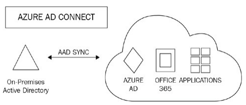
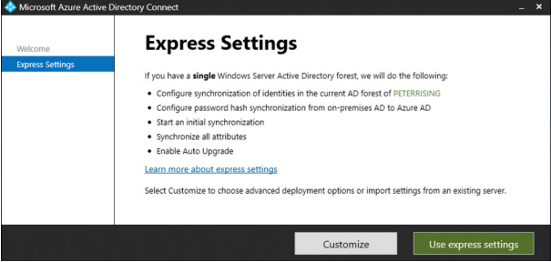
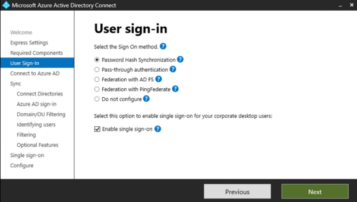
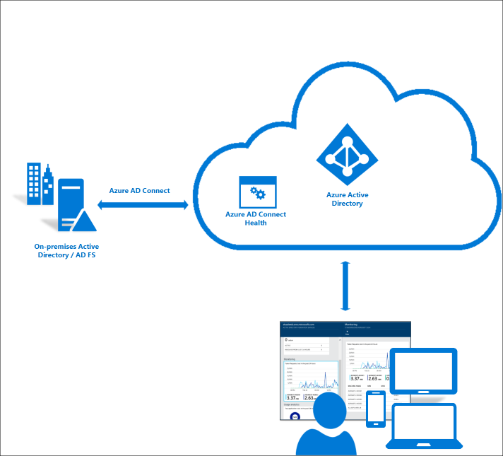

# Azure-AD-Connect
Synchronization methods with Azure AD Connect
Use Sentinel. Run Failed Login Attempt Query. Turn on Fusion Machine Learning.

<h2>Description</h2>
The tool used to configure directory synchronization is called Azure AD Connect. Microsoft AD Connect <b>features</b> <br />
<p><b>Password hash synchronization -</b> A sign-in method that synchronizes a hash of a users on-premises AD password with Microsoft Entra ID.</p>
<p><b>Pass-through authentication -</b> A sign-in method that allows users to use the same password on-premises and in the cloud, but doesn't require the additional infrastructure of a federated environment.</p>
<p><b>Federation integration -</b> Federation is an optional part of Microsoft Entra Connect and can be used to configure a hybrid environment using an on-premises AD FS infrastructure. It also provides AD FS management capabilities such as certificate renewal and additional AD FS server deployments.</p>
<p><b>Synchronization -</b> Responsible for creating users, groups, and other objects. As well as, making sure identity information for your on-premises users and groups is matching the cloud. This synchronization also includes password hashes.</p>
<p><b>Health Monitoring -</b> Microsoft Entra Connect Health can provide robust monitoring and provide a central location in the Microsoft Entra admin center to view this activity.</p>
 <br />


<p>Azure AD Connect supports multiple AD forests and multiple Exchange organizations to a single Microsoft 365 tenant. It synchronizes users, groups, and contact objects from your
on-premises AD to Microsoft 365.<br />
There are some writeback capabilities that can be leveraged if chosen or required, which will allow attributes from passwords and groups set in Microsoft 365 to be
written back to an on-premises AD.<br />
The principles of Azure AD Connect are shown in the following diagram:<br />

<br />
<p> <b>Express Settings:</b> default setting for Azure AD Connect and is designed for use with password hash synchronization from a single AD forest. <br /></p>

<br />
<p><b>Custom Settings:</b> With the custom settings installation, you are provided with the following options to extend your on-premises identities in the cloud using Azure AD
Connect. </p><br />
 <br />


<h2>Microsoft Azure AD Connect Health</h2>
 <p>Microsoft Azure AD Connect Health provides robust monitoring of your on-premises identity infrastructure. It enables you to maintain a reliable connection to Microsoft 365 and Microsoft Online Services. This reliability is achieved by providing monitoring capabilities for your key identity components. Also, it makes the key data points about these components easily accessible.</p>
<p>Use the Microsoft Azure AD Connect Health portal to view alerts, performance monitoring, usage analytics, and other information. Microsoft Azure AD Connect Health enables the single lens of health for your key identity components in one place.</p>

 <br />

<h2>Licnese Requirement:</h2>
<p>1. Microsoft Azure AD Connect: Free </p>
<p>2. Microsoft Azyre AD Connect Health: Azure AD Premium P1</p>


<!--
 ```diff
- text in red
+ text in green
! text in orange
# text in gray
@@ text in purple (and bold)@@
```
--!>
